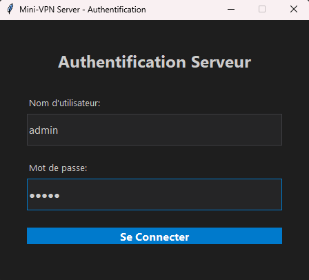
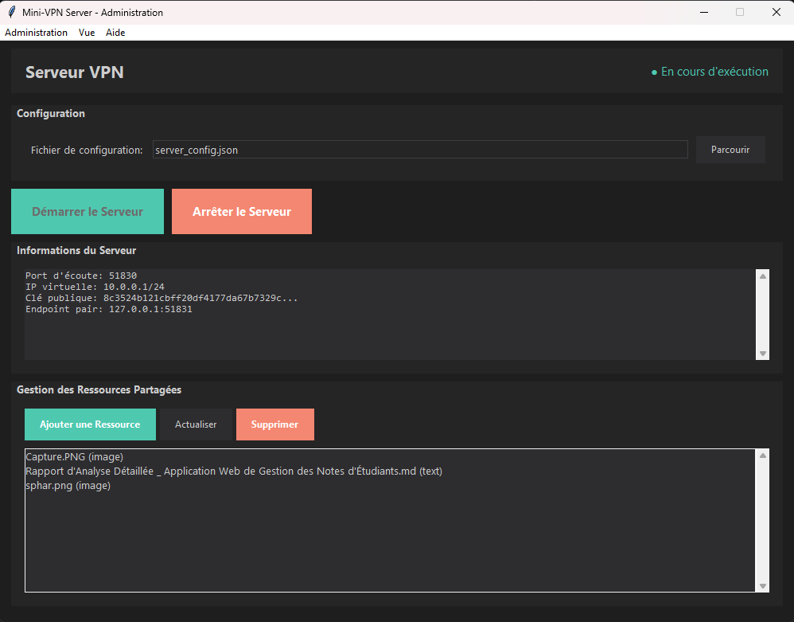
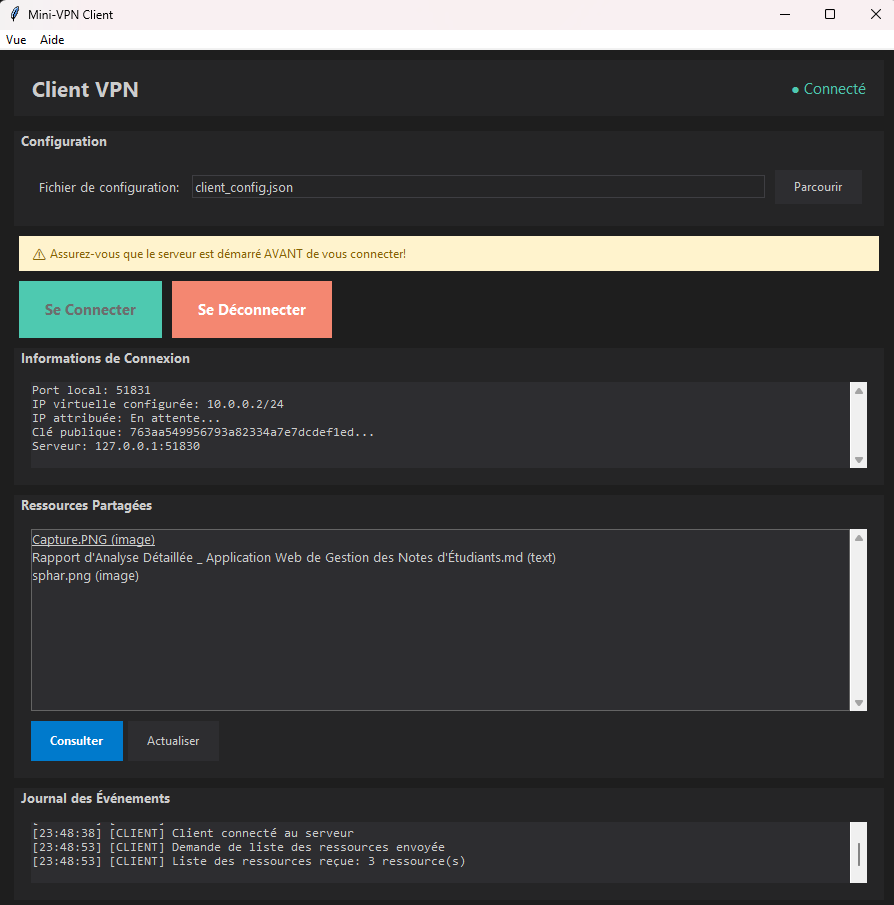

# mini_vpn — Lightweight VPN Prototype

[](https://www.python.org)
[](LICENSE)

A compact VPN prototype written in Python that demonstrates the key components of a client/server VPN: handshake, crypto, DHCP-like addressing, packet forwarding and a simple GUI for server and client control. This repository is intended for learning, prototyping and lab use only.

---

## Contents / Quick Links

- Overview
- Screenshots
- Quick start
- Usage
- Configuration
- Implementation notes
- Troubleshooting & tips
- Contributing & License

---

## Overview

mini_vpn is a teaching/proof-of-concept VPN implementation. It implements basic tunnel behavior, encryption/handshake, user management and a small GUI for server and client control. It is NOT intended for production use — it lacks hardened security features required for a production VPN.

Key components
- server.py — core VPN server and packet handling
- client.py — client-side logic for handshake and packet exchange
- crypto.py / handshake.py — cryptographic helpers and handshake flow
- dhcp_server.py — lightweight address assignment for connected clients
- gui_server.py / gui_client.py — simple GUI controls
- scripts to launch and manage users

---

## Screenshots

Images included in the repository are integrated below for better visibility. They live at the repository root and will render on GitHub automatically.

### Server: Login screen


### Server: Control panel / status


### Client: GUI / Connected view


---

## Quick start (local / lab)

1. Clone the repository:
```bash
git clone https://github.com/b1l4l-sec/mini_vpn.git
cd mini_vpn
```

2. (Recommended) Create and activate a Python virtualenv:
```bash
python3 -m venv .venv
source .venv/bin/activate
```

3. Install (very small) requirements:
```bash
pip install -r requirements.txt
```

4. Generate keys (if required by the configuration):
```bash
python3 generate_keys.py
```

5. Start the server (console or GUI):
- Console:
```bash
python3 server.py
```
- GUI server:
```bash
python3 gui_server.py
```

6. Start a client (console or GUI):
- Console:
```bash
python3 client.py
```
- GUI client:
```bash
python3 gui_client.py
```

There are helper launch scripts for convenience:
- `launch_server.sh` / `launch_server.bat`
- `launch_client.sh` / `launch_client.bat`
- `launch_gui.sh` / `launch_gui.bat`

---

## Usage & common commands

- Check environment and ports:
```bash
python3 check_setup.py
python3 check_ports.py
```

- Manage users:
```bash
python3 manage_users.py
# follow prompts to add/remove users
```

- Setup VPN networking (requires root on host):
```bash
sudo python3 setup_vpn.py
```

- To run the GUI client/server from virtualenv (Linux):
```bash
. .venv/bin/activate
python3 gui_server.py
python3 gui_client.py
```

---

## Configuration

Edit configuration values in `config.py` to set:
- network ranges / addressing
- ports used by server/client
- crypto parameters (recommended to keep defaults for lab)
- logging location

There is a light-weight `client_config copy.json` demonstrating the client configuration fields.

---

## Implementation notes

- Crypto primitives and handshake flow are implemented in `crypto.py` and `handshake.py`. This project demonstrates concepts — do not reuse keys or algorithms as-is in production.
- Packet construction/parsing lives in `packet.py`.
- The server maintains user sessions, assigns addresses and forwards traffic between clients and the host network.
- The project includes simple scripts and utilities to manage users and test the setup.

---

## Troubleshooting & Tips

- GUI fails to start: ensure dependencies and virtualenv are active.
- Ports in use: run `lsof -i :<PORT>` and free the port or change `config.py`.
- Permission issues for networking tasks: some scripts require root (sudo) — do not run on production hosts.
- If you want to test with the GUI on Windows, use the provided `.bat` launchers.

---

## Security & Disclaimer

This project is for educational and lab use only. mini_vpn is not hardened for production. Do not expose instances to untrusted networks and do not use real credentials or sensitive data when testing.

---

## Contributing

Contributions and improvements are welcome. Please:
1. Fork the repo
2. Create a feature branch
3. Open a pull request with a clear description and tests/examples

---

## License

MIT — see the `LICENSE` file.

---

Made by b1l4l-sec — feel free to ask me to commit this updated README to the repo (create branch + PR) or to produce a shorter/longer variant.  
