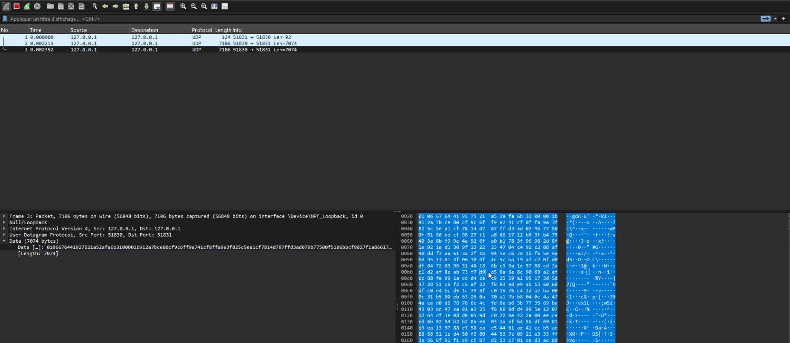
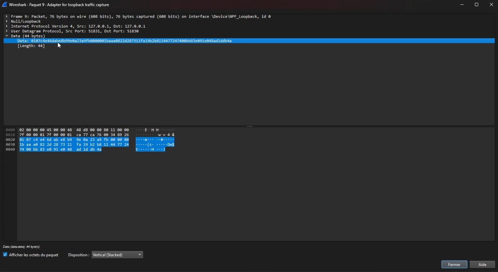

# mini_vpn — Lightweight VPN Prototype

[](https://www.python.org)
[](LICENSE)

A compact VPN prototype written in Python that demonstrates the key components of a client/server VPN: handshake, crypto, DHCP-like addressing, packet forwarding and a simple GUI for server and client control. This repository is intended for learning, prototyping and lab use only.

---

## Contents / Quick Links

- Overview
- Screenshots & VPN traffic captures
- Quick start
- Usage
- Configuration
- Implementation notes
- Troubleshooting & tips
- Contributing & License

---

## Overview

mini_vpn is a teaching/proof-of-concept VPN implementation. It implements basic tunnel behavior, encryption/handshake, user management and a small GUI for server and client control. It is NOT intended for production use — it lacks hardened security features required for a production VPN.

Key components
- server.py — core VPN server and packet handling
- client.py — client-side logic for handshake and packet exchange
- crypto.py / handshake.py — cryptographic helpers and handshake flow
- dhcp_server.py — lightweight address assignment for connected clients
- gui_server.py / gui_client.py — simple GUI controls
- scripts to launch and manage users

---

## Screenshots & VPN traffic captures

Images included in the repository are embedded below for better visibility. They live at the repository root and will render on GitHub automatically.

### Server: Login screen


### Server: Control panel / status


### Client: GUI / Connected view


---

## VPN Traffic Captures (Wireshark / VOPData)

The following captures show example VPN traffic and packet contents captured via Wireshark during test sessions. These help illustrate encapsulation, handshake exchanges and encrypted payloads.

### Capture 1 — Overview of handshake and first packets


### Capture 2 — Detailed packet flow and payload markers


> Note: Captures are provided for inspection and educational purposes only. They contain no real user data — use only in isolated lab environments.

---

## Quick start (local / lab)

1. Clone the repository:
```bash
git clone https://github.com/b1l4l-sec/mini_vpn.git
cd mini_vpn
```

2. (Recommended) Create and activate a Python virtualenv:
```bash
python3 -m venv .venv
source .venv/bin/activate
```

3. Install requirements:
```bash
pip install -r requirements.txt
```

4. Generate keys (if required by the configuration):
```bash
python3 generate_keys.py
```

5. Start the server (console or GUI):
- Console:
```bash
python3 server.py
```
- GUI server:
```bash
python3 gui_server.py
```

6. Start a client (console or GUI):
- Console:
```bash
python3 client.py
```
- GUI client:
```bash
python3 gui_client.py
```

Helper launch scripts:
- `launch_server.sh` / `launch_server.bat`
- `launch_client.sh` / `launch_client.bat`
- `launch_gui.sh` / `launch_gui.bat`

---

## Usage & common commands

- Environment & port checks:
```bash
python3 check_setup.py
python3 check_ports.py
```

- Manage users:
```bash
python3 manage_users.py
```

- Setup VPN networking (requires root on host):
```bash
sudo python3 setup_vpn.py
```

- Run GUI from virtualenv (Linux):
```bash
. .venv/bin/activate
python3 gui_server.py
python3 gui_client.py
```

---

## Configuration

Edit `config.py` to set:
- network ranges / addressing
- ports used by server/client
- crypto parameters (lab defaults recommended)
- logging location

Example client config: `client_config copy.json`

---

## Implementation notes

- `crypto.py` and `handshake.py` demonstrate handshake and encryption flows (educational).
- `packet.py` handles encapsulation/parsing.
- `dhcp_server.py` assigns addresses to connected clients.
- `server.py` maintains sessions and forwards packets.
- This project is modular to facilitate learning and testing.

---

## Troubleshooting & Tips

- GUI fails to start: ensure the virtualenv is activated and dependencies installed.
- Ports in use: run `lsof -i :<PORT>` and free or change port in `config.py`.
- Networking scripts require root; do not run on production systems.
- Use the provided `.bat` launchers on Windows for GUI testing.

---

## Security & Disclaimer

This project is for educational and lab use only. mini_vpn is not hardened for production. Do not expose instances to untrusted networks and do not use real credentials or sensitive data when testing.

---

## Contributing

Contributions welcome:
1. Fork the repo
2. Create a feature branch
3. Open a pull request with description and tests/examples

---

## License

MIT — see the `LICENSE` file.

---

Made by b1l4l-sec — if you'd like I can open a branch, commit this README update and create a PR. Please tell me whether you want:
- I: create a branch + commit + open PR, or
- II: commit directly to main (not recommended), or
- III: just provide this content so you can paste it yourself.
